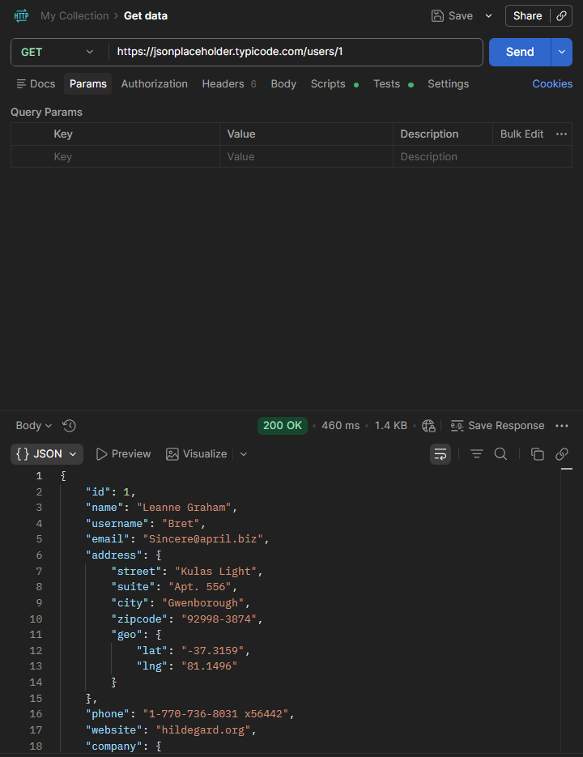
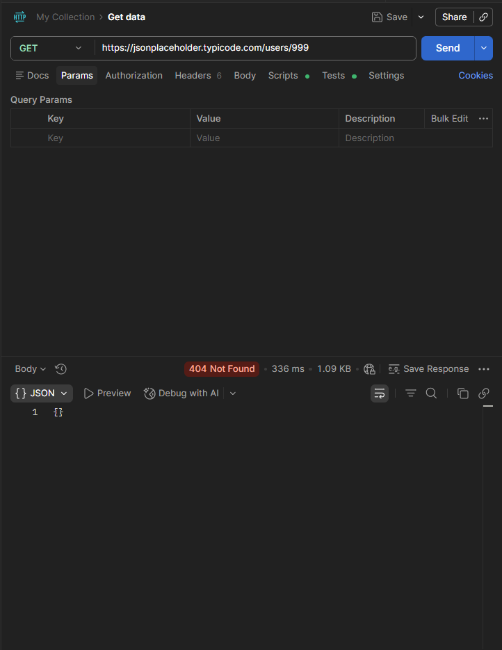
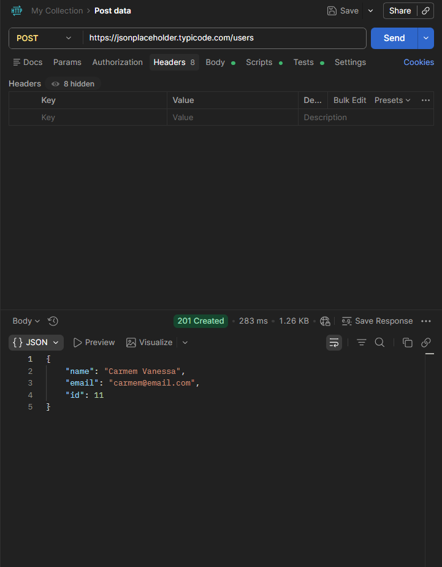

# 📸 Evidências dos Testes de API

---

# ✅ GET — Usuário válido

### Observação:
A API retornou corretamente os dados do usuário com status 200 OK.

---

# ✅ GET — Usuário inexistente

### Observação:
A API retornou status 404 Not Found e objeto vazio ao buscar um usuário inexistente.

---

# ✅ POST — Criação de usuário

### Observação:
A API criou corretamente o usuário e retornou status 201 Created com ID gerado automaticamente.
